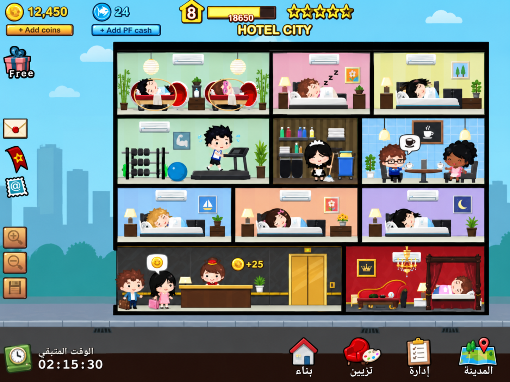

# HC-VIS-001 — عقد العينة البصرية الأولى

07-09-2026 — مواصفة إنتاج `READY`؛ الأصول الجديدة لم تُنتج أو تُعتمد داخل المحرك بعد.
المرجع: DEC-015/016 والخطة الرسمية. ينفذ Codex الفن والدمج البرمجي مباشرة.

SHA-256: `3be2d50401acf77739d4c96ca6c01e3e84cdb40fa67dd31a04a82af906e848c8`.
الصورة مرجع للشكل؛ أزرار PF cash والأرقام والنجوم فيها ليست قرارات ميزات أو توازن.

## عقد الأسلوب

فندق أمامي مقطعي، غرف مستطيلة بفواصل سوداء واضحة، أثاث بسيط، رؤوس كبيرة ووجوه نقطية. جدران باستيل مسطحة؛ ظلال تماس صغيرة ودرجة تظليل واحدة أو اثنتان. تبقى المدينة أقل تباينًا من الفندق. لا خامة فوتوغرافية أو إضاءة واقعية أو منظور isometric.

قيم العمل التالية مبدئية للعينة، وليست ادعاءً بقياس بكسلات الصورة بدقة:

| العنصر | قاعدة الإنتاج عند المقاس المنطقي |
|---|---|
| الشبكة | تبقى `128×96` لكل block؛ اللوبي `2×1` والغرفة الاقتصادية `1×1` |
| حدود الغرفة | 4px تقريبًا؛ حدود الأثاث 1.5–2px؛ تُراجع عند تقريب الهاتف |
| الشخصيات | إطار `48×72` وpivot `(24,70)`؛ تصدير 2× = `96×144` |
| نسبة الرأس | نحو 50–60% من الشكل الظاهر؛ الوجه يُقرأ عند تصغير الشاشة |
| حجم العرض | تجربة 0.85–0.95 من حجم الشخصية المنطقي؛ لا يتغير الكود قبل قياس السرير والأبواب ومسار السير معًا |
| الألوان | خطوط `#151713`، جدار نعناعي `#B7D8B4`، أزرق `#9ACCEC`، وردي `#E7B0C6`، كريمي `#F0E5A1`، خلفية سماء `#6CCDEB`؛ تُعاير في لقطة المحرك |
| التكوين | قطعة أثاث رئيسية واضحة، وبقية القطع الثماني لا تحجب الوجه أو مسار التفاعل |

## المشهد والأصول

العينة تستخدم المعرفات المنطقية الحالية؛ لا تُنشئ فندقًا تجريبيًا بدل حفظ اللاعب ولا تضيف نوع ضيف جديدًا.

| المجموعة | مخرج العينة | عقد الدمج |
|---|---|---|
| اللوبي | جدار/أرضية، باب دخول، مكتب خلفي وواجهة مكتب | `room.lobby.base` و`room.lobby.front`؛ نقاط انتظار وتسليم مفتاح وعمل استقبال |
| الغرفة الاقتصادية | خلفية، سرير خلفي وغطاء أمامي، وسادة، مصباح، قطعة جدار | `room.economy.base` ومعرفات القطع الحالية؛ الرأس على الوسادة والغطاء يحجب الجسم فقط |
| المصعد | إطار، بابان منفصلان، كبينة، مؤشر وصول | طلب أصل جديد محدود؛ نقاط انتظار/دخول/خروج لكل مستوى، ولا يُستبدل انتقال الطابق بتلاشٍ فقط |
| النزيل | idle / blink / walk / sleep / reaction | `guest_standard`؛ ملفات `data/animations/` هي مصدر عدد الإطارات وFPS |
| الاستقبال | idle / walk / work / reaction | `staff_receptionist`؛ اليد تصل للمفتاح والموظف خلف واجهة المكتب |
| التنظيف | idle / walk / work / reaction | `staff_cleaner`؛ الأداة واليد ونقطة العمل تتطابق أثناء الدورة |
| صور مصغرة | السرير والمصباح وقطعة الجدار | مشتقات مستقلة مقروءة عند `64×64`؛ لا نص داخل الصورة |

لكل أصل: المسار، الأبعاد المنطقية والمصدّرة، الشفافية، anchor، حدود الرسم، hitbox ونقاط التفاعل. تُقرأ أبعاد صور الخلفيات من manifest الحالي قبل الإخراج، ولا تُساوى تلقائيًا بأبعاد block. تُفصل أجزاء الحجب الأمامية عن الخلفية.

## إنتاج يحافظ على المصدر

- مرجع الفندق الكامل في `docs/reference/` فقط؛ لا يُحمَّل خلفيةً للعبة.
- مصادر العينة الجديدة في مجلد مستقل تحت `art-source/approved/` عند إنشائها، ومعها metadata وبصمة ونسخة. المجلد خارج أهداف مولدات `tools/art/` الحالية.
- تُدمج ملفات runtime في `public/assets/` بالمسارات التي يعتمدها manifest. قبل أول دمج جديد يُضاف حارس يمنع `gen:art` من الكتابة فوق الأصول المعتمدة؛ لا يكفي توثيق الحماية وحده.
- يبقى `gen:assets` لتحديث الفهرس مستقلاً عن إعادة رسم الفن.
- الصورة المولدة وأوراق الإطارات لا تمنح حالة `VISUAL_APPROVED`؛ يلزم ظهور الأصول أثناء اللعب.

## الاتجاهان

| مساحة اختبار CSS | طريقة عرض العينة المستهدفة |
|---|---|
| `390×844` و`360×800` | غرفة مقروءة أو غرفتان بحسب الحجم، سحب وتقريب؛ لا تصغير الفندق كله على حساب الوجوه |
| `844×390` و`800×360` | رؤية أوسع للطابق، وأدوات موجزة؛ القوائم تمرر آخر صف وزر الإغلاق يبقى ظاهرًا |
| `1280×800` | مشهد عام مع تقريب يطابق مقياس الهاتف عند مقارنة الفن |

هذه مقاسات اختبار وليست قائمة أجهزة معتمدة. تُختبر العربية والإنجليزية، والتدوير والقائمة مفتوحة، وحواف النتوء والإيماءات على جانبي الشاشة. لا تُمدد الغرفة أو الشخصية لتملأ الاتجاه الجديد؛ تتغير الكاميرا والمساحة المتاحة فقط. حد اللمس 44 CSS px للأدوات، ويمكن أن تكون منطقة لمس الشخصية أكبر من رسمها.

## الأنيميشن والصوت

دورة العينة: وصول بحقيبة → انتظار → تسليم مفتاح → مصعد → دخول الغرفة → نوم → استيقاظ وخروج → تنظيف → جاهزية الغرفة.

- السير يثبت القدم على الأرض، ويعتمد التوقيت على مسافة الحركة؛ لا انزلاق أو اهتزاز pivot يزيد على بكسل منطقي بلا قصد.
- الانتقالات أحادية التشغيل، وتعود الحالات المتكررة بسلاسة. تُحفظ هوية الوجه والثياب وحجم الرأس بين الإطارات.
- المحاكاة تحدد الخدمة والدخل والاتساخ؛ اكتمال clip لا يكرر مكافأة أو يغير الحفظ.
- المؤثرات: جرس ومفتاح وباب ومصعد وتنظيف وتحصيل. صوت واحد أو أصوات قليلة متزامنة بأولوية واضحة، ثم مراجعة سمعية قبل التعميم.
- تعليق التطبيق وكتم الصوت وتقليل الحركة حالات اختبار؛ لا موسيقى جاهزة معتمدة حاليًا.

## بوابة قبول العينة

1. إصلاح ART-REFRESH وإثبات زوال placeholder بعد تحميل الديكور المتأخر من دون تبديل الوردية.
2. لقطة من المحرك بالطول والعرض وبحجم مقارنة ثابت مع المرجع، وملاحظات الفروق ومعالجتها.
3. فيديو لدورة الضيف والتنظيف يثبت التلامس والطبقات والمصعد وعدم الانتقال الفجائي.
4. تحميل بارد وإعادة فتح التطبيق وحفظ قديم وجديد، بلا ضياع مواضع أو تقدم.
5. قياس أداء العينة على iPhone وAndroid فعليين؛ هدف 60fps مبدئي، ويُسجّل القياس لا الافتراض.

بعد اجتياز هذه البوابة تُعمم الحزمة. إعداد Capacitor في HC-P0-S10 لا يثبت أيًا من بنود اعتماد الفن أعلاه.
