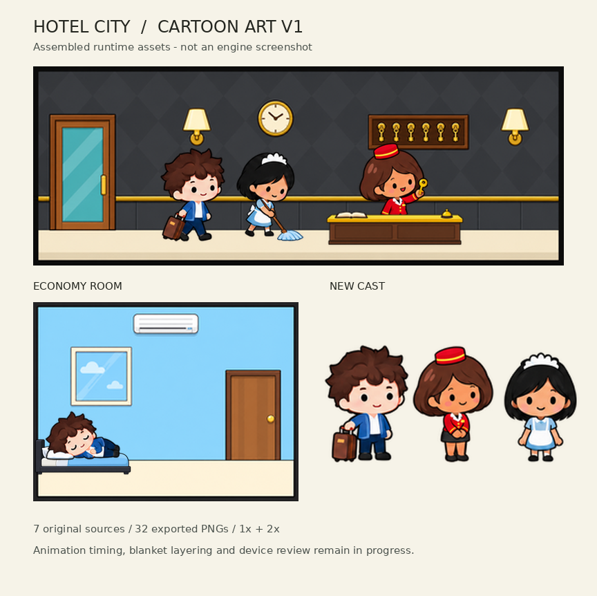

# HC-VIS-001B — تقرير إنتاج الرسومات الجديدة

آخر تحديث: 08-09-2026 UTC. الحالة: **IMPLEMENTED — الاعتماد البصري داخل المحرك معلق**.

## ما نُفذ

بُنيت سبعة مصادر أصلية بأداة ImageGen من الصورة المعتمدة: خلفيتا اللوبي والاقتصادية، مكتب استقبال منفصل، سرير، وأوراق وضعيات النزيل وموظفة الاستقبال والمنظفة. حُفظت المصادر وأوامرها وبصماتها في `art-source/approved/cartoon-v1/`، وصُدّرت 32 صورة تشغيل فعلية بدقتي 1× و2× إلى المسارات الحالية في `public/assets/`.

فُحصت شفافية PNG فعليًا؛ المحاولات الأولى التي حملت مربعات مطبوعة استُبعدت، وصُححت بأداة الصور قبل التصدير. ترتيب القص وعدد الإطارات وFPS بقي من ملفات `data/animations/`. استُخدم مقياس واحد للشخصية عبر وضعيات الوقوف، ومحاذاة القدم إلى pivot (24,70)، مع رفع رسم النائم 10 بكسلات منطقية داخل إطاره كي يستقر على المرتبة بدلاً من الأرض. صُحح تناسب عامل النظافة أيضًا: لا يتسبب امتداد الممسحة في تصغير الشخصية كلها، مع بقاء الأطراف داخل الإطار. لم تتغير معرّفات اللعبة أو الحفظ أو مواضع الديكور المخزنة.

المكتب في طبقة front الحالية، ضمن غلاف الرسم المقيس x140..209/y51..87. السرير أصل مستقل، لا أثاث إضافي مطبوع في الخلفيتين. ملفات الليل والاتساخ مشتقة من الفن الجديد بتحويلات اللعبة الحالية؛ طبقة الحشرات الحالية باقية.

حارس فعلي يمنع `gen:art` من البدء، ويمنع كذلك مولدات الغرف والديكور والشخصيات القديمة من إعادة كتابة المسارات المحمية. أمر `gen:art:approved` وحده يعيد تصدير هذه المصادر. فحص بصمات المصدر والتصدير والأبعاد مُدمج في البناء باستخدام Node فقط، دون إضافة اعتماد Python إلى بناء التطبيق.

## التحقق

| الفحص | النتيجة المحلية |
|---|---|
| `npm run verify` | ناجح: 92 اختبار Vitest و776 فحصًا ذاتيًا؛ 4 تحذيرات lint قائمة، بلا أخطاء |
| `npm run mobile:build` | ناجح؛ JS gzip نحو 335KB / 350KB، الفن والصوت نحو 8933KB / 12288KB |
| `npm run check:art` | 7 بصمات مصدر و32 تصديرًا صحيح الأبعاد في الفهرس |
| `node --experimental-strip-types tools/selftest/animations.ts` | 22 فحصًا؛ انجراف أسفل الإطار 0px، وعدم قص الأطراف، ولم يحدث تكرار كامل لأي clip |
| محاولة `gen:art` وثلاثة مولدات قديمة مباشرة | أربعة رفضات من الحارس الفعلي، وكل بصمات الأصول المحمية لم تتغير |
| `python3 tools/art/preview_approved.py` | راجعت تجميع الأصول الحالية بصريًا؛ ليس تصويرًا للمحرك |

Node المحلي 24.19.0؛ اجتاز الإصدار الأول CI على Node 22 (run 34168046680). تعديل تناسب الشخصيات اللاحق اجتاز محليًا verify وmobile:build؛ نتيجة CI لهذا التعديل تتبع رأس PR. لا توجد نتيجة جديدة لقياس iPhone/Android أو فيديو دورة لعب أو اعتماد رسوم GPU. معاينة الفرع في المتصفح السحابي غير متاحة بعد خطأ ERR_BLOCKED_BY_CLIENT المسجل في HC-VIS-001A؛ لا تُستبدل بلقطة من الفرع المنشور القديم.

عالج التحقق تعارضين تاريخيين محددين: منع الأسود في ART-0 استبدلته DEC-015 للغرفتين المعاد رسمهما فقط؛ وفحص shipping ظل يحمل 8MB بينما سقف 12MB معتمد منذ HC-P2-S1 بتاريخ 05-09-2026. صار فحصا الميزانية يقرآن الأرقام المعتمدة نفسها من `tools/performance-budgets.json`؛ لم تُرفع الميزانية في هذه الدفعة.

## الدليل البصري والحدود

التجميع يوضح الألوان والوجوه ووقوف الموظفة خلف المكتب. الغرفة الاقتصادية معروضة بسريرها المضمن؛ محتويات المتجر لم يعاد رسمها كاملة. لم يصل تكوين الغرفة بعد إلى امتلاء الغرف في المرجع، ولم تفصل طبقة الغطاء الأمامية. عرض المصدر وتطابق البكسلات لا يثبتان واقعية التلامس أو دورة مشي مثالية.

النزيل happy يحمل ثلاث وضعيات مختلفة مع تثبيت الأخيرة للنبضة الرابعة؛ خمول المنظفة يستخدم وضعيتين. تسجل exports.json هذا صراحة. ما زالت حركة تسليم المفتاح والتلامس مع الممسحة، والنوم على الأسرّة المطوّرة، والأثاث الأكبر تحتاج مراجعة المحرك. لا ادعاء باكتمال الأنيميشن الحقيقي أو المصعد أو الأصوات أو بقية الكتالوج. لم يُنفذ رفع متجر أو دمج إلى main.

## مطابقة التنفيذ مع المرجع

تحقق بدء الرسم الفعلي والدمج في عائلة الفن الكرتوني الأمامي، مع حماية المصادر والحفظ. لم تجتز العينة الكاملة بوابة HC-VIS-001 بعد؛ لذلك لا تنتقل إلى التعميم ولا تُمنح VISUAL_APPROVED. الخطوة التالية هي إكمال طبقات الأثاث والتلامس ومراجعتها داخل المحرك بالاتجاهين.

1. **الخطة:** مطابقة لـ DEC-015/016/017؛ دفعة إنتاج واحدة ضمن HC-VIS-001.
2. **التنفيذ:** IMPLEMENTED؛ سبعة مصادر و32 ملف تشغيل.
3. **التحقق:** الفحوص المحلية ناجحة؛ CI موثق في PR، والاعتماد البصري معلق.
4. **العائق:** لا تصوير محرك للفرع ولا فحص أجهزة فعلي؛ طبقة الغطاء والمصعد والتلامس غير مكتملة.
5. **الخطوة التالية الوحيدة:** استكمال ومراجعة التلامس وطبقات العينة داخل المحرك قبل تعميمها.
